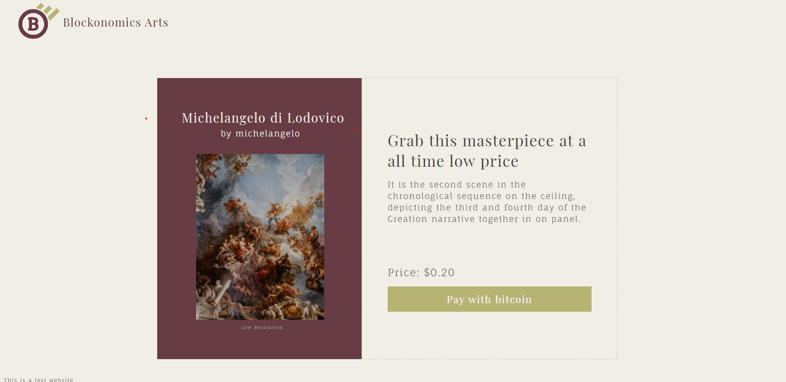

# Blockonomics Bitcoin Payment store 
A web app to buy art by paying in bitcoins       

[](https://github.com/atiqg/blockonomics-bitcoin-payment)

[Try Web App](https://blockonomics-test.netlify.app/)       

## Assignment:           
[✔️] Store contains only a single image art priced 0.20USD      
[✔️] By default it displays thumbnail of the image    
[✔️] USD to BTC Conversion          
[✔️] Show QR and Address to user for BTC payment        
[✔️] Payment Countdown       
[✔️] On payment via BTC the complete high resolution image is shown to user       
[✔️] Use blockonomics payments [API](https://www.blockonomics.co/views/api.html)       

[✔️] Link to website where we can try out the assignment        
[✔️] Complete source code. You can send us github/gitlab link      
</br>

## Installation
#### Step 1
```
git clone https://github.com/atiqg/blockonomics-bitcoin-payment.git
cd blockonomics-bitcoin-payment
npm install
```

#### Step 2
* Go to [blockonomics site](https://www.blockonomics.co/) and make a free account
* Create a bitcoin wallet and save your xpub in blockonomics account [detailed video](https://www.youtube.com/watch?v=eTdEZ-0MDYM)
* Get your api key which will be required in next step
* Set payment_confirmation function as you http callback function in blockonomics account


#### Step 3
* make a website on netlify with name 'blockonomics-test'
* If you choose another name then change url accordingly in script.js and functions files
* Add env variable in you netlify website name as 'API_KEY' given in step 2 
* You can test bitcoin address endpoint by passing reset=1 to get same address again

#### Step 4
* You should be fine, once everything is done in previous steps 
* You can test webapp by making a fake bitcoin transaction from blockonomics test page